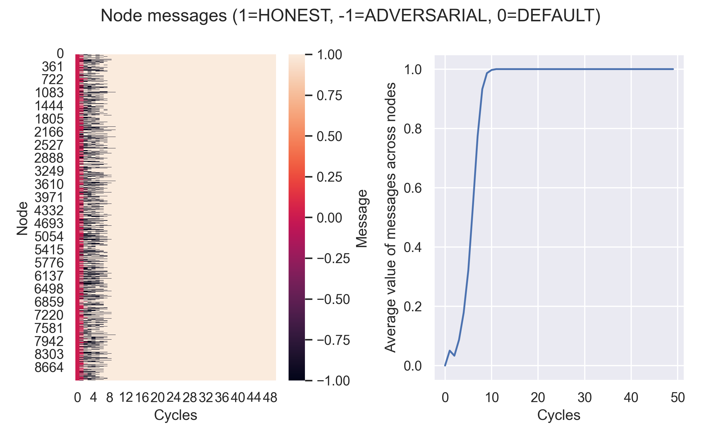
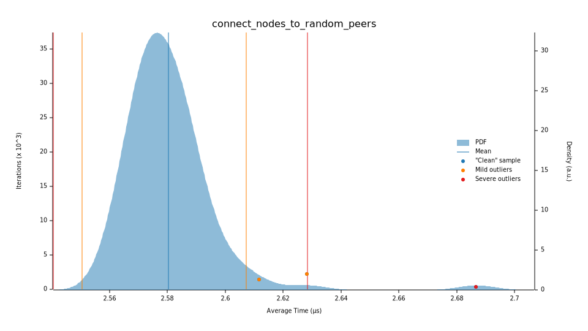
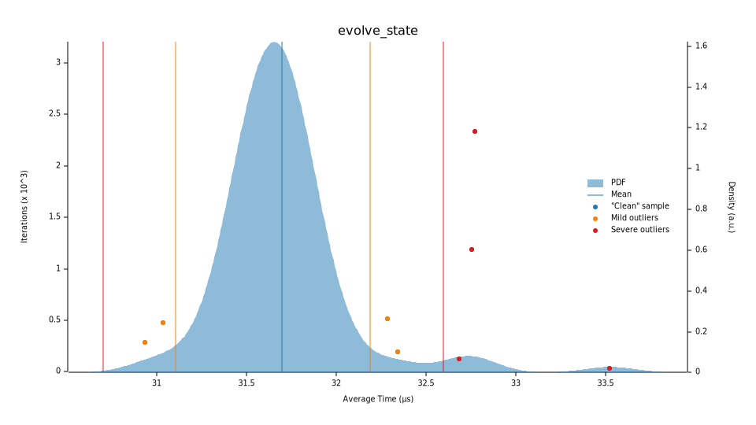

[](https://github.com/dineshpinto/gossip-protocol-rs/actions/workflows/rust.yml)

# gossip-protocol-rs

Rust implementation of a synchronous gossip protocol.

## Build Rust library

```bash
cargo build --release
cargo run --release
```

## Build Python bindings (optional)

Add `crate-type = ["cdylib"]` under `[lib]` to `Cargo.toml` to build as a dynamic library.

```bash
poetry install --with dev
poetry run maturin build --release
```

This will build the Python bindings and place them in `target/wheels` . To install the wheels

```bash
poetry add target/wheels/<name-of-wheel>.whl
```

```ipython
>>> from gossip_protocol_rs import pyrun_gossip_protocol
>>> res = pyrun_gossip_protocol(num_honest_sample=6, num_adversarial_sample=4,
    num_non_sample=10000, num_peers=6, cycles=100)
```

## Simulation




See [dineshpinto/synchronous-gossip-protocol](https://github.com/dineshpinto/synchronous-gossip-protocol) for a pure
Python implementation, along with additional
theoretical details.

## Benchmark

Uses `criterion` to benchmark the library.

```bash
cargo bench
```




