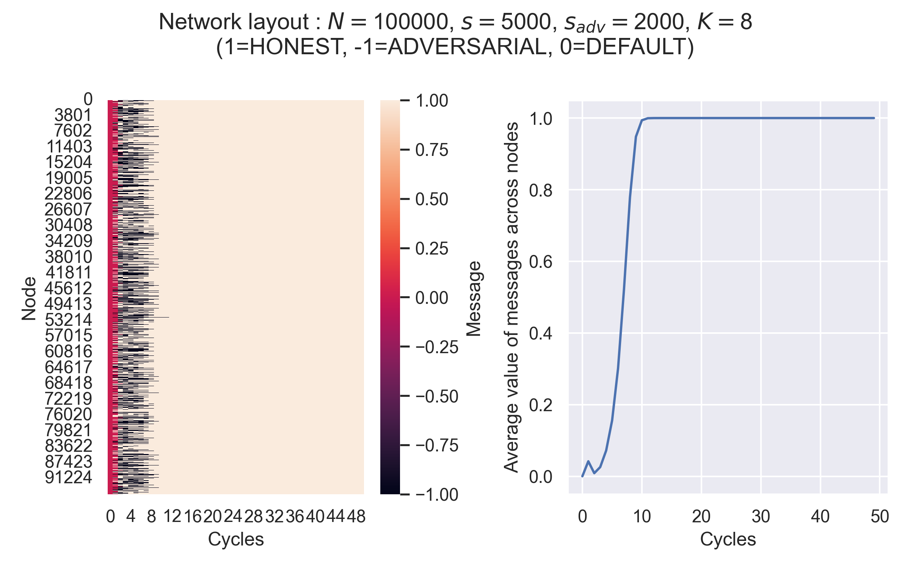

# gossip-protocol-rs

Rust implementation of a synchronous gossip protocol.

## Build Rust library

```bash
git clone https://github.com/dineshpinto/gossip-protocol-rs.git
cd gossip-protocol-rs
cargo build --release
cargo run --release
```

## Build Python bindings

Add `crate-type = ["cdylib"]` under `[lib]` to `Cargo.toml` to build as a dynamic library.

```bash
cd gossip-protocol-rs
poetry install --with dev
poetry run maturin develop --release
```

```ipython
>>> from gossip_protocol_rs import run_gossip_protocol
>>> res = run_gossip_protocol(num_honest_sample=5, num_adversarial_sample=4,
    num_non_sample=1000, num_peers=6, cycles=200)
```

## Simulation

See [dineshpinto/synchronous-gossip-protocol](https://github.com/dineshpinto/synchronous-gossip-protocol) for a pure
Python implementation, along with additional theoretical details.



